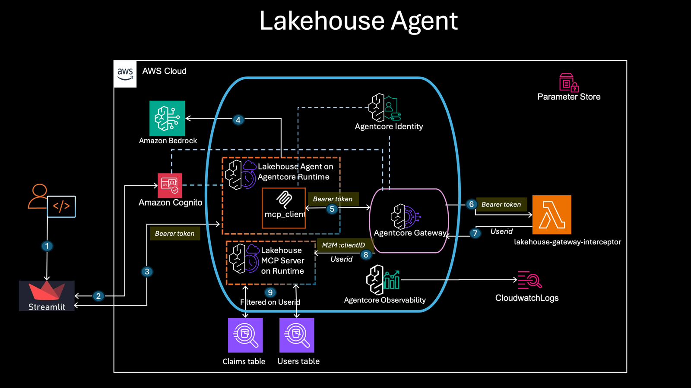
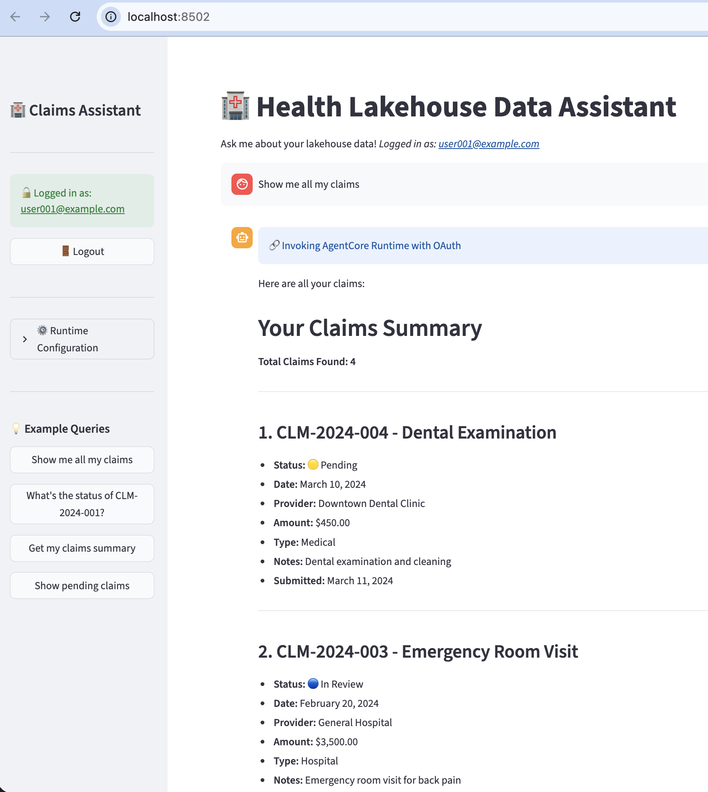
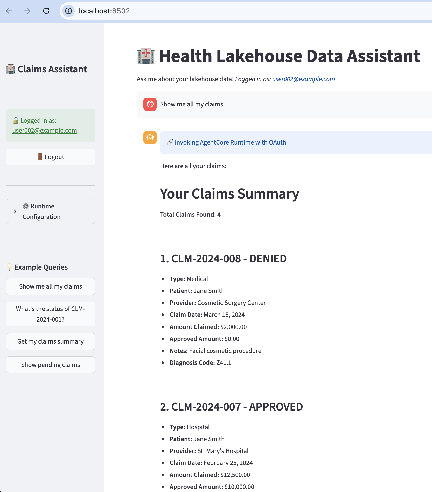

# Lakehouse Agent with OAuth Authentication

A lakehouse data processing system demonstrating Amazon Bedrock AgentCore capabilities with end-to-end OAuth authentication, row-level security based on federated user identity, and conversational AI for data queries.

## Table of Contents

- [Overview](#overview)
- [Architecture](#architecture)
- [Key Features](#key-features)
- [Prerequisites](#prerequisites)
- [Quick Start](#quick-start)
- [Deployment Steps](#deployment-steps)
- [Testing](#testing)
- [Usage Examples](#usage-examples)
- [Troubleshooting](#troubleshooting)
- [Cost Estimate](#cost-estimate)

---

## Overview

This system showcases a lakehouse data processing application with:

- **Streamlit UI** with Cognito OAuth authentication
- **AI-Powered Lakehouse Agent** hosted on AgentCore Runtime using Strands framework
- **AgentCore Gateway** with JWT token validation via interceptor Lambda
- **MCP Server** connecting to AWS Athena for data queries
- **OAuth credentials** propagated through the entire stack (UI → Agent → Gateway → MCP → Athena)
- **Row-Level Security** enforced through federated user identity

### What Makes This Production-Ready

✅ **End-to-End OAuth**: JWT bearer tokens validated at every layer
✅ **Row-Level Security**: Agentcore lambda interceptors translate user tokens to user identity which is passed on to the MCP server to ensure row-level access control
✅ **Conversational AI**: Natural language interface for data queries
✅ **Scalable Architecture**: AgentCore Runtime and Gateway for production workloads
✅ **Full Audit Trail**: CloudTrail logs all data access with user identity
✅ **Secure by Design**: Token validation at multiple checkpoints

---

## Architecture

### High-Level Architecture




### Authentication flow
```
┌─────────────────────────────────────────────────────────────────┐
│                        User Layer                               │
│  ┌────────────────┐                                             │
│  │ Streamlit UI   │ OAuth login via Cognito (USER CREDENTIALS)  │
│  │ + Cognito Auth │ Client: lakehouse-client                    │
│  └────────┬───────┘                                             │
└───────────┼─────────────────────────────────────────────────────┘
            │ Bearer Token (JWT with user identity)
            │
┌───────────▼─────────────────────────────────────────────────────┐
│                      AI Agent Layer                             │
│  ┌────────────────┐                                             │
│  │Lakehouse Agent │ Strands-based conversational agent          │
│  │ AgentCore      │ Natural language data processing            │
│  │ Runtime        │ JWT Authorizer validates USER token         │
│  └────────┬───────┘ Allowed: lakehouse-client (user auth)       │
└───────────┼─────────────────────────────────────────────────────┘
            │ Bearer Token + Tool Request
            │
┌───────────▼─────────────────────────────────────────────────────┐
│                Gateway & Policy Layer                           │
│  ┌──────────────────────────────────────────────────────────┐   │
│  │  AgentCore Gateway + Interceptor Lambda                  │   │
│  │  - Validates JWT tokens (USER token from agent)          │   │
│  │  - Extracts user identity (email)                        │   │
│  │  - Enforces scope-based tool access                      │   │
│  │  - Adds user identity to request headers                 │   │
│  │  JWT Inbound: lakehouse-client (user auth)               │   │
│  │                                                          │   │
│  │  OAuth Provider: lakehouse-mcp-m2m-oauth-provider        │   │
│  │  - Gateway obtains M2M token for MCP Runtime             │   │
│  │  - Client: lakehouse-m2m-client (M2M only)               │   │
│  └────────┬─────────────────────────────────────────────────┘   │
└───────────┼─────────────────────────────────────────────────────┘
            │ M2M Token + User Identity + Tool Request
            │
┌───────────▼─────────────────────────────────────────────────────┐
│                    Tool Execution Layer                         │
│  ┌────────────────────────────────────────────────────────────┐ │
│  │  MCP Server (AgentCore Runtime)                            │ │
│  │  Athena connector for data queries                         │ │
│  │  JWT Authorizer validates M2M token                        │ │
│  │  Allowed: lakehouse-m2m-client (M2M only)                  │ │
│  │  - Receives user_id from Gateway (X-User-Principal)        │ │
│  │  - Executes Athena queries                                 │ │
│  │  - Returns query results                                   │ │
│  └────────┬───────────────────────────────────────────────────┘ │
└───────────┼─────────────────────────────────────────────────────┘
            │ Athena Query
            │
┌───────────▼────────────────────────────────────────────────────┐
│                       Data Layer                               │
│  ┌──────────────────────────────────────────────────────────┐  │
│  │  AWS Athena + Glue Data Catalog                          │  │
│  │  • lakehouse_db database                                 │  │
│  │  • claims table                                          │  │
│  │  • users table (metadata)                                │  │
│  │  • Executes queries and returns results                  │  │
│  │  • S3 backend for data storage                           │  │
│  └──────────────────────────────────────────────────────────┘  │
└────────────────────────────────────────────────────────────────┘
```

### Data Flow Example: User Query

```
1. User Login
   Streamlit UI → Cognito → Returns JWT with user identity
   JWT contains: {
     "email": "user001@example.com",
     "scope": "lakehouse-api/claims.query"
   }

2. Query Submission
   User: "Show me all claims"

   UI → Agent Runtime
   POST /agent-runtime
   Headers:
     Authorization: Bearer <JWT_token>  ← Token in header for JWT validation
   Body:
     {
       "prompt": "Show me all claims",
       "bearer_token": "<JWT_token>"    ← Token also in body for agent to use
     }

3. Agent Runtime Processing
   a) JWT Authorizer validates token (signature, expiration, audience)
   b) Agent code extracts token from payload (JWT authorizer consumes header)
   c) Agent creates MCP client to Gateway with bearer token
   d) Agent uses AI to decide which tools to call

   Agent → Gateway
   POST /gateway
   Headers:
     Authorization: Bearer <JWT_token>  ← Same token passed through
   Body:
     {"jsonrpc": "2.0", "method": "tools/call", "params": {...}}

4. Gateway Interception
   Interceptor Lambda:
   - Validates JWT signature ✓
   - Checks token expiration ✓
   - Extracts user identity: "user001@example.com"
   - Validates scope: "claims.query" ✓
   - Adds header: X-User-Principal: user001@example.com

   Gateway → MCP Server (with user context)

5. Tool Execution
   MCP Server:
   - Extracts user from X-User-Principal header
   - Executes Athena query
   - Query: SELECT * FROM claims WHERE status = 'pending'
   - Returns results

6. Athena Execution
   Athena executes query → Returns results

7. Response Flow
   Athena → MCP → Gateway → Agent → UI
   Agent formats results naturally
   User sees: "I found 3 pending claims..."

Key Points:
✅ Bearer token in Authorization header (for JWT validation at runtime entry)
✅ Bearer token also in payload (for agent code to use with Gateway)
   Note: JWT authorizer consumes Authorization header and doesn't pass it through
✅ Token validated at agent entry (JWT authorizer)
✅ Token validated at gateway entry (Interceptor Lambda)
✅ User identity propagated through entire chain
```

---

## Key Features

### Security Features

- **🔒 End-to-End OAuth**: JWT bearer tokens with multi-layer validation
- **� Row-Level Security**: Agentcore Lambda interceptor translates JWT tokens on federated user identity to user principals 
- **� Fine-Grained Access Control**: JWT scopes determine which tools users can access
- **�  Token Propagation**: User identity flows through entire system
- **� Full AudiIt Trail**: CloudTrail logs all data access with user identity
- **🛡️ Gateway Interceptor**: Policy-based tool access enforcement

### Application Features

- **🏥 Health Insurance Operations**: Query claims data conversationally
- **💬 Conversational AI**: Natural language interface for data queries
- **☁️ AWS Athena Integration**: Scalable data queries
- **🎯 Multi-User Support**: User identity tracked throughout request flow

---

## Prerequisites

### AWS Account Setup

1. **AWS Account**:
   - AWS Account ID (e.g., XXXXXXXXXXXX)
   - Region: us-east-1 (configurable)

2. **AWS Permissions**:
   ```
   - BedrockAgentCoreFullAccess
   - AmazonBedrockFullAccess
   - AmazonAthenaFullAccess
   - AmazonS3FullAccess
   - AWSLambdaFullAccess
   - AmazonCognitoPowerUser
   - SSMFullAccess
   ```

3. **AWS Services**:
   - Amazon Bedrock (with Claude Sonnet 4.5 access)
   - Amazon Bedrock AgentCore
   - AWS Lambda
   - Amazon Cognito
   - AWS Athena
   - AWS Glue
   - Amazon S3
   - AWS Systems Manager (SSM Parameter Store)

### Development Environment

```bash
# Python 3.10 or later
python --version

# Create virtual environment
python -m venv .venv

# Activate virtual environment
# On macOS/Linux:
source .venv/bin/activate
# On Windows:
# .venv\Scripts\activate

# Install dependencies
pip install -r requirements.txt
```


## Quick Start

The fastest way to deploy the complete system is through the provided Jupyter notebooks. Run them in sequence:

### Prerequisites

Ensure you have AWS credentials configured:

```bash
# Option 1: Using .env file (Recommended)
# Create a .env file in this directory with your AWS credentials:
# AWS_ACCESS_KEY_ID=your-access-key-id
# AWS_SECRET_ACCESS_KEY=your-secret-access-key
# AWS_SESSION_TOKEN=your-session-token  # Optional, for STS credentials
# AWS_DEFAULT_REGION=us-east-1

# Option 2: If using SSO
export AWS_PROFILE=your-profile-name
aws sso login --profile your-profile-name

# Option 3: If using access keys
aws configure
```

### Deployment via Notebooks

Start Jupyter and run the notebooks in order:

```bash
jupyter notebook
```

**Notebook Sequence**:

1. **00-prerequisites-setup.ipynb** - Configure environment and create S3 bucket
2. **01-deploy-athena.ipynb** - Deploy Athena database with sample data
3. **02-deploy-cognito.ipynb** - Set up OAuth with Cognito user pool
4. **03-deploy-mcp-server.ipynb** - Deploy MCP server on AgentCore Runtime
5. **04-deploy-gateway.ipynb** - Deploy Gateway with JWT interceptor
6. **05-deploy-agent.ipynb** - Deploy conversational AI agent
7. **06-streamlit-ui-deployment.ipynb** - Test end-to-end flow with OAuth
8. **07-optional-cleanup.ipynb** - Clean up all deployed resources (optional)

**Total deployment time**: ~2-3 hours

**Credential Loading**: All notebooks use centralized credential loading that automatically detects and uses credentials from your `.env` file, environment variables, or AWS SSO (in that order of priority). No need to configure credentials separately in each notebook.

Each notebook:
- Explains what it deploys
- Shows progress and outputs
- Saves configuration to SSM Parameter Store
- Can be re-run safely (idempotent where possible)

### What Gets Deployed

- **S3 Bucket**: Data storage for Athena
- **Athena Database**: `lakehouse_db` with `claims` and `users` tables
- **Cognito User Pool**: OAuth authentication with test users
- **MCP Server**: Tool execution layer on AgentCore Runtime
- **Gateway**: Request routing with JWT validation
- **Agent**: Conversational AI on AgentCore Runtime
- **Test Users**: user001@example.com, user002@example.com (password: TempPass123!)

### Cleanup

To remove all deployed resources, run **07-optional-cleanup.ipynb**. This notebook will:
- Delete all AgentCore Runtimes and Gateways
- Delete Lambda functions
- Delete Cognito User Pool
- Delete Athena database and tables
- Optionally delete S3 bucket and data
- Delete all SSM parameters

### Quick Test

After deployment, test with:

```python
# In notebook 06 or programmatically
Query: "Show me all claims"
Expected: Conversational response with claims data
```

### Manual Deployment (Alternative)

If you prefer command-line deployment instead of notebooks, see the [Deployment Steps](#deployment-steps) section below.

---

## Deployment Steps

This section provides manual command-line deployment instructions as an alternative to the notebooks.

### Complete Deployment Roadmap

| Phase | Component | Command | Duration |
|-------|-----------|---------|----------|
| 1 | Athena Database | `python setup_athena.py` | 5 min |
| 2 | Cognito User Pool | `python setup_cognito.py` | 5 min |
| 3 | MCP Server | `python deploy_runtime.py --yes` | 10 min |
| 4 | Gateway & Interceptor | `python deploy_interceptor.py` + `python create_gateway.py --yes` | 5 min |
| 5 | Lakehouse Agent | `python deploy_lakehouse_agent.py --yes` | 5 min |
| 6 | Streamlit UI | `streamlit run streamlit_app.py` | 5 min |


**Total Time**: ~2.5 hours

### Manual Deployment Commands

If deploying via command line instead of notebooks:

```bash
# Step 1: Deploy Athena
cd athena-setup
python setup_athena.py

# Step 2: Deploy Cognito
cd ../cognito-setup
python setup_cognito.py

# Step 3: Deploy MCP Server
cd ../mcp-lakehouse-server
python deploy_runtime.py --yes

# Step 4: Deploy Gateway & Interceptor
cd ../gateway-setup/interceptor
python deploy_interceptor.py
cd ..
python create_gateway.py --yes

# Step 5: Deploy Agent
cd ../lakehouse-agent
python deploy_lakehouse_agent.py --yes

# Step 6: Test
cd ..
streamlit run streamlit_app.py
```

### Key Configuration Features

**All scripts use**:
- ✅ **AWS session utility** (`aws_session_utils.py`) for SSO support
- ✅ **SSM Parameter Store** for sharing configuration
- ✅ **Automatic region detection** from AWS credentials
- ✅ **--yes flags** for notebook automation (skip interactive prompts)

---

## Testing
**Test flow**:
1. Get OAuth token from Cognito
2. Call Agent Runtime with bearer token in header
3. Agent processes natural language query
4. Agent calls Gateway tools (validated by interceptor)
5. MCP Server executes Athena query
6. Results returned through chain

**Expected output**:
```
✅ Token obtained: eyJraWQiOiJxxx...
✅ Agent response received
✅ Tool calls: 1
📝 Agent output: "I found 9 claims in the database..."
```

### Manual Test via Streamlit

```bash
cd streamlit-ui
streamlit run streamlit_app.py
```

Test queries:
- "Show me all claims"
- "Get claims summary"
- "What claims are pending?"

### User-Specific Data Access Demo

The lakehouse agent implements row-level security (RLS) through Agentcore Lambda interceptors, ensuring users only see data they're authorized to access. Based on the logged-in user, you can see how user-specific datasets are shared in the screenshots below:

#### Test User 1 - Limited Access


**User**: `testuser1` - Shows limited dataset access based on user permissions. This user can only see claims and data that they are authorized to view through row-level filters.

#### Test User 2 - Different Data Scope  


**User**: `testuser2` - Shows a different set of data based on their specific permissions. Notice how the same query returns different results depending on the authenticated user's access rights.

**Key Security Features Demonstrated**:
- ✅ **Row-Level Security**: Each user sees only their authorized data
- ✅ **OAuth Integration**: User identity flows from Cognito through the entire system
- ✅ **Consistent Experience**: Same interface, personalized data based on user context

---

## Usage Examples

### Example 1: Query All Claims

```
User: "Show me all claims"

Agent Response:
"I found 9 claims in the database:

1. Claim CLM-001 - Amount: $500, Status: Approved
2. Claim CLM-002 - Amount: $1200, Status: Pending
3. Claim CLM-003 - Amount: $300, Status: Approved
...

Would you like details on any specific claim?"
```

### Example 2: Get Claims Summary

```
User: "Give me a summary of all claims"

Agent Response:
"Here's your claims summary:

Total Claims: 9
Total Amount: $8,900

By Status:
- Approved: 4 claims ($3,200)
- Pending: 3 claims ($2,700)
- Denied: 2 claims ($3,000)

By Type:
- Medical: 5 claims ($5,000)
- Prescription: 2 claims ($800)
- Hospital: 2 claims ($3,100)"
```

### Example 3: Check Claim Status

```
User: "What's the status of claim CLM-001?"

Agent Response:
"Claim CLM-001 details:

Status: Approved ✓
Amount: $500
Provider: City Hospital
Type: Medical Visit
Submitted Date: 2024-01-15
Processed Date: 2024-01-18"
```

---

## Troubleshooting

### Common Issues

| Issue | Cause | Solution |
|-------|-------|----------|
| **AWS credentials not found** | Missing .env file or invalid credentials | Create .env file with valid AWS credentials |
| **Token has expired** | STS credentials expired | Update .env with fresh credentials or use SSO |
| **No credentials** | AWS_PROFILE not set (SSO) | `export AWS_PROFILE=your-profile` |
| **Bearer token required** | No token in request | Ensure token in Authorization header |
| **Invalid token** | Token expired or wrong client | Get new token from Cognito |
| **Gateway timeout** | MCP server slow | Increase Lambda timeout to 300s |
| **Athena permission denied** | Missing IAM permissions | Check execution role has Athena access |

### Credential Troubleshooting

#### .env File Issues

**Error: "AWS credentials not found" or "No credentials configured"**
```bash
# Check if .env file exists
ls -la .env

# If missing, create it with your credentials:
cat > .env << EOF
AWS_ACCESS_KEY_ID=your-access-key-id
AWS_SECRET_ACCESS_KEY=your-secret-access-key
AWS_SESSION_TOKEN=your-session-token
AWS_DEFAULT_REGION=us-east-1
EOF
```

**Error: "Token has expired" (when using STS credentials)**
```bash
# Get new temporary credentials and update .env file
# Example using assume-role:
aws sts assume-role --role-arn arn:aws:iam::ACCOUNT:role/ROLE --role-session-name session

# Then update .env with the new credentials
```

**Error: "Environment variables not loaded"**
- Restart Jupyter kernel to reload environment variables
- Ensure `.env` file is in the correct directory (`02-use-cases/lakehouse-agent/`)
- Check file permissions: `chmod 600 .env`

### AWS SSO Troubleshooting

**Error: "Token has expired and refresh failed"**
```bash
# Solution: Re-login
aws sso logout
aws sso login --profile your-profile-name
```

**Error: "Profile not found"**
```bash
# Check profiles
aws configure list-profiles

# If missing, reconfigure
aws configure sso
```

**Error: "You must specify a region"**
```bash
# Set region in profile
aws configure set region us-east-1 --profile your-profile

# Or environment variable
export AWS_DEFAULT_REGION=us-east-1
```

### Debug Commands

```bash
# Check configuration in SSM
python test_ssm_validation.py

# Check agent status
python check_agent_status.py

# View CloudWatch logs (replace runtime-id)
aws logs tail /aws/bedrock-agentcore/runtime/runtime-id --follow

# View Gateway interceptor logs
aws logs tail /aws/lambda/lakehouse-gateway-interceptor --follow

# View MCP server logs
aws logs tail /aws/bedrock-agentcore/runtime/mcp-server-id --follow

# Test JWT token
python gateway-setup/test_cognito_login.py
```

### Logs to Check

**Agent Runtime logs**:
```bash
aws logs tail /aws/bedrock-agentcore/runtime/<runtime-id> --follow
```

Expected:
```
✅ Bearer token extracted from Authorization header
✅ Loaded 5 tools from Gateway
⏳ Processing request...
✅ Request processed
```

**Interceptor Lambda logs**:
```bash
aws logs tail /aws/lambda/lakehouse-gateway-interceptor --follow
```

Expected:
```
INFO Bearer token extracted from MCP gateway request
INFO Token validation successful
INFO User: user001@example.com
```

---

## File Structure

```
lakehouse-agent/
│
├── 📦 Utilities
│   └── aws_session_utils.py        # AWS SSO session management
│
├── 🗄️ Data Layer
│   └── athena-setup/
│       ├── setup_athena.py         # Athena database setup
│       ├── create_tables.sql       # Table definitions
│       └── sample_data.sql         # Sample data
│
├── 🔐 Identity Layer
│   └── cognito-setup/
│       └── setup_cognito.py        # Cognito OAuth setup
│
├── 🌐 Gateway Layer
│   └── gateway-setup/
│       ├── create_gateway.py       # Gateway creation
│       └── interceptor/
│           ├── lambda_function.py  # JWT validator
│           └── deploy_interceptor.py # Deployment script
│
├── 🔧 Tool Layer
│   └── mcp-lakehouse-server/
│       ├── server.py               # MCP server
│       ├── athena_tools.py         # Athena query tools
│       ├── requirements.txt        # Dependencies
│       └── deploy_runtime.py       # Deployment script
│
├── 🤖 Agent Layer
│   └── lakehouse-agent/
│       ├── lakehouse_agent.py      # Strands-based agent
│       ├── requirements.txt        # Dependencies
│       └── deploy_lakehouse_agent.py # Deployment script
│
├── 🖥️ UI Layer
│   └── streamlit-ui/
│       ├── streamlit_app.py        # Main UI application
│       └── requirements.txt        # Dependencies
│
└── 🧪 Testing
    └── tests/
        ├── test_athena.py          # Database tests
        ├── test_cognito.py         # Auth tests
        ├── test_gateway.py         # Gateway tests
        ├── test_agent.py           # Agent tests
        └── test_end_to_end.py      # Integration tests
```

---

## Cost Estimate

### Monthly Cost Breakdown (Approximate)

```
Component                      Monthly Cost
─────────────────────────────────────────────
S3 Storage (100GB)             $2.30
Athena (1TB scanned/month)     $5.00
Lambda (1M invocations)        $0.20
Cognito (1000 users)           $0.00 (free tier)
AgentCore Runtime (2 runtimes) $50-$100
Bedrock Claude API             Variable (per token)
─────────────────────────────────────────────
Total (excluding Bedrock)      ~$60-$110/month
```

### Cost Optimization Tips

- Use Parquet format for S3 data (reduces Athena scan costs by 90%)
- Partition data by date (faster queries, lower costs)
- Cache frequent queries in application layer
- Monitor Bedrock token usage with CloudWatch

---

## OAuth Scopes

The system uses JWT scopes for fine-grained access control:

| Scope | Description | Allows |
|-------|-------------|--------|
| `lakehouse-api/claims.query` | Read claims | query_claims, get_claim_details, get_claims_summary |
| `lakehouse-api/claims.submit` | Submit claims | submit_claim |
| `lakehouse-api/claims.update` | Update claims | update_claim_status |

Scopes are validated in the Gateway interceptor Lambda.

---

## Support & Resources

### AWS Documentation

- [Bedrock AgentCore](https://docs.aws.amazon.com/bedrock/latest/userguide/agents.html)
- [Amazon Athena](https://docs.aws.amazon.com/athena/)
- [Amazon Cognito](https://docs.aws.amazon.com/cognito/)
- [AWS Lambda](https://docs.aws.amazon.com/lambda/)

### Community

- AWS Forums: https://forums.aws.amazon.com/
- Stack Overflow tags: `amazon-bedrock`, `amazon-athena`, `aws-lambda`

---

## License

This project is licensed under the Apache License 2.0 - see the LICENSE file for details.

---

**Status**: Production-Ready ✅
**Authentication**: End-to-End OAuth with JWT
**Last Updated**: January 2025
